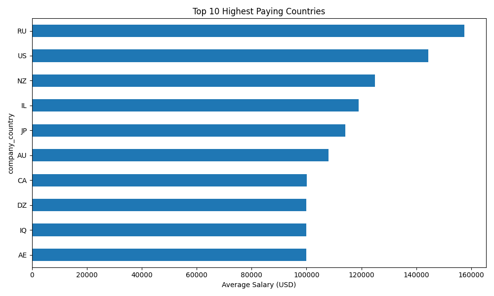
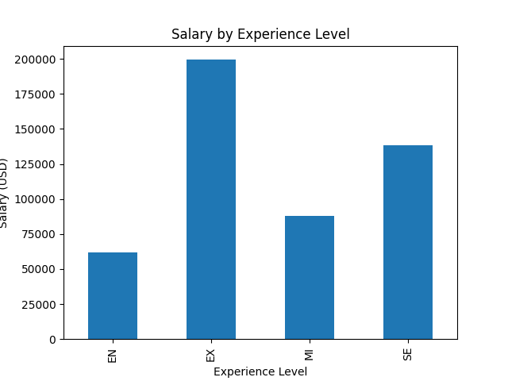
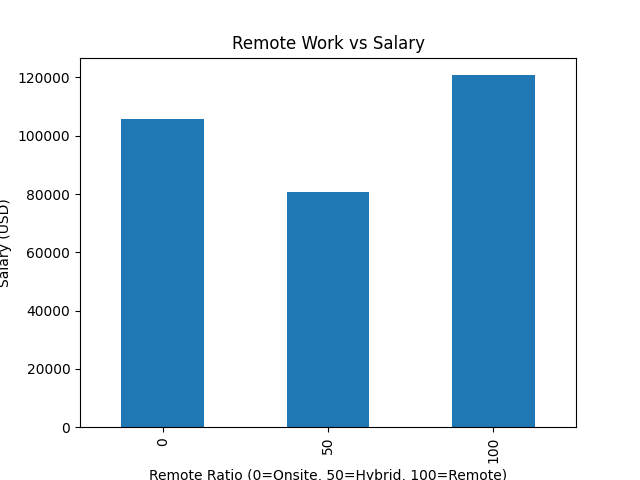
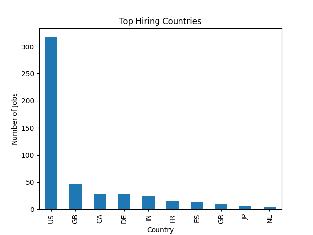
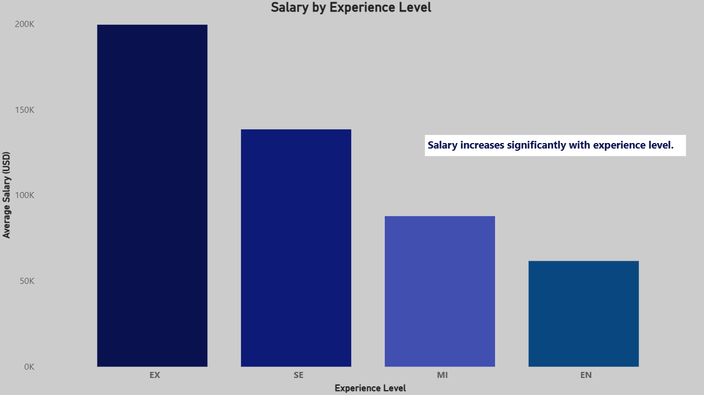
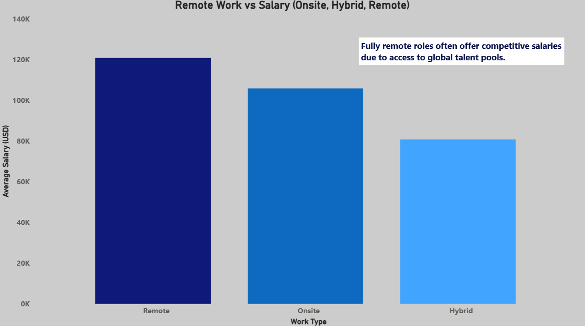

# 🌍 Global Data Salary Insights

## 📌 Overview
This project analyzes global salary trends, hiring demand, and remote work impact for data roles using Python, SQL (BigQuery), and Power BI.

The goal is to understand how geography, experience level, and remote work influence compensation in the global data job market.

---

## 🎯 Motivation
As a data analyst aspiring to work internationally, I built this project to explore global salary benchmarks, hiring hotspots, and the impact of remote work on compensation.

---

## 🛠 Tech Stack
- Python (Pandas, Matplotlib)
- SQL (BigQuery)
- Power BI
- Google Cloud Platform

---

## 📂 Dataset
Source: Data Science Job Salaries dataset (Kaggle)

The dataset includes:
- Job titles  
- Salary in USD  
- Company location  
- Experience level  
- Remote work ratio  

---

## 📊 Key Insights
- Experience level significantly impacts salary growth across all regions.
- Remote roles offer competitive compensation due to access to global talent.
- High-paying countries are concentrated in mature tech economies.
- Significant salary disparities exist between developed and emerging markets.
- Hiring demand is concentrated in global tech hubs.

---

SQL queries used in this project are available in `sql/salary_analysis_queries.sql`. 

--- 

## 📊 Python Analysis Visuals

These visuals were generated using Python to explore salary trends and hiring patterns.

### Salary by Country


### Salary by Experience Level


### Remote Work Impact


### Hiring Hotspots


---

## 📊 Power BI Dashboard

The Power BI dashboard provides an interactive view of global salary trends and hiring demand.






---

## 🧩 Project Workflow
Raw Data → Python Cleaning → BigQuery SQL Analysis → Python EDA → Power BI Dashboard

---

## ▶️ How to Run

1️⃣ Run data cleaning script:
```bash
python scripts/data_cleaning.py